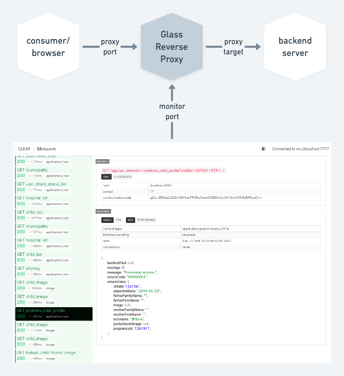

# Glass Reverse Proxy
HTTP reverse proxy with request and response viewer  
for monitoring Web service, backend Web API, and so on.  
!! use only for development !!



## Get Started

```
git clone https://github.com/sukobuto/glass-reverse-proxy.git
cd glass-reverse-proxy
npm i
npm run-script build
node run.js -m 18000 -p 8080 -t http://localhost:8000
```

then access to http://localhost:18000

## Usage

`node run.js [options]`

options

- `-m <port>` `--monitor-port=<port>`
    - designate the port number for monitoring
- `-p <port>` `--proxy-port=<port>`
    - designate the port number for proxy service
- `-t <base url>` `--proxy-target=<base url>`
    - designate the url of the backend server

## Use on Docker

pull from [dockerhub](https://cloud.docker.com/u/sukobuto/repository/docker/sukobuto/glass-reverse-proxy)
```
docker pull sukobuto/glass-reverse-proxy
```

and then run
```
docker run -d --name grp \
    -p 18000:18000 \
    -p 8080:8080 \
    glass-reverse-proxy
```

run with options
```
docker run -d --name grp \
    -e "MONITOR_PORT=7777" \
    -e "PROXY_PORT=8888" \
    -e "PROXY_TARGET=8080" \
    -p 7777:7777 \
    -p 8888:8888 \
    glass-reverse-proxy
```
